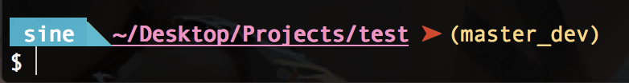

# Terminal-Outlook

> vi ~/.bash_profile 

> vi ~/.bashrc

both OK

```
// git branch
parse_git_branch() {
     git branch 2> /dev/null | sed -e '/^[^*]/d' -e 's/* \(.*\)/ (\1)/'
}
```

## Example


```bash
$ vi ~/.bash_profile

parse_git_branch() {
     git branch 2> /dev/null | sed -e '/^[^*]/d' -e 's/* \(.*\)/ (\1)/'
}

export PS1="\n\e[1;39;46m \u \e[4;96;49m◣ \e[1;35;49m\w\e[0;31;49m ➤\e[0;93;49m\$(parse_git_branch) \n\[\033[m\]\$ "

export CLICOLOR=1
export LSCOLORS=CxExCxDxCxegedabagaced
alias ls='ls -GFh' 
```

- \d: Date
- \h: Host
- \n: Newline
- \t: Time
- \u: Username
- \W: Current working directory
- \w: Full path to current directory

## Adding Some Color

```sh
txtblk='\e[0;30m' # Black - Regular
txtred='\e[0;31m' # Red
txtgrn='\e[0;32m' # Green
txtylw='\e[0;33m' # Yellow
txtblu='\e[0;34m' # Blue
txtpur='\e[0;35m' # Purple
txtcyn='\e[0;36m' # Cyan
txtwht='\e[0;37m' # White
 
bldblk='\e[1;30m' # Black - Bold
bldred='\e[1;31m' # Red
bldgrn='\e[1;32m' # Green
bldylw='\e[1;33m' # Yellow
bldblu='\e[1;34m' # Blue
bldpur='\e[1;35m' # Purple
bldcyn='\e[1;36m' # Cyan
bldwht='\e[1;37m' # White
 
unkblk='\e[4;30m' # Black - Underline
undred='\e[4;31m' # Red
undgrn='\e[4;32m' # Green
undylw='\e[4;33m' # Yellow
undblu='\e[4;34m' # Blue
undpur='\e[4;35m' # Purple
undcyn='\e[4;36m' # Cyan
undwht='\e[4;37m' # White
 
bakblk='\e[40m'   # Black - Background
bakred='\e[41m'   # Red
badgrn='\e[42m'   # Green
bakylw='\e[43m'   # Yellow
bakblu='\e[44m'   # Blue
bakpur='\e[45m'   # Purple
bakcyn='\e[46m'   # Cyan
bakwht='\e[47m'   # White
 
txtrst='\e[0m'    # Text Reset
```

```
COLOR_RED="\033[0;31m"
COLOR_YELLOW="\033[0;33m"
COLOR_GREEN="\033[0;32m"
COLOR_OCHRE="\033[38;5;95m"
COLOR_BLUE="\033[0;34m"
COLOR_WHITE="\033[0;37m"
COLOR_RESET="\033[0m"

function git_color {
  local git_status="$(git status 2>/dev/null | tail -n 1)"

  if [[ $git_status =~ "working directory clean" ]]; then
    echo -e $COLOR_GREEN
  elif [[ $git_status =~ "Your branch is ahead of" ]]; then
    echo -e $COLOR_BLUE
  elif [[ $git_status =~ "nothing to commit" ]]; then
    echo -e $COLOR_WHITE
  else
    echo -e $COLOR_YELLOW
  fi
}

function git_branch {
  local git_status="$ git status 2> /dev/null"
  local on_branch="On branch ([^${IFS}]*)"
  local on_commit="HEAD detached at ([^${IFS}]*)"

  if [[ $git_status =~ $on_branch ]]; then
    local branch=${BASH_REMATCH[1]}
    echo "($branch)"
  elif [[ $git_status =~ $on_commit ]]; then
    local commit=${BASH_REMATCH[1]}
    echo "($commit)"
  fi
}

parse_git_branch() {
     git branch 2> /dev/null | sed -e '/^[^*]/d' -e 's/* \(.*\)/ ⎇ \1/'
}

export PS1="\n\e[1;39;46m \u \e[4;96;49m◣ \e[1;35;49m\w\e[0;31;49m\e[\$(git_color)\$(parse_git_branch) \n\[\033[m\]\$ "

export CLICOLOR=1
export LSCOLORS=CxExCxDxCxegedabagaced
alias ls='ls -GFh' 

alias st='git status'
alias pl='git pull'
alias ps='git push'
alias rsh='git rest --hard'
alias rb='git rebase'
alias rbc='git add . && git rebase --continue'
alias rbs='git rebase --skip'
alias mg='git merge'
alias br='git branch'
alias ck='git checkout'
alias ckb='git checkout -b'
alias log='git log'
alias logp='git log --pretty=format:"%h %s" --graph'
alias cm='git add . && git commit -m'
alias pss='git push --set-upstream origin'
```
